# Customizing oXygen XML for Pure Lexicographic Pleasure

**Topic**: This guideline is about customizing, shortcutting and improving your workflow using oXygen XML Editor.

**Contributor**: Toma Tasovac, Belgrade Center for Digital Humanities. 

**Version:** 0.1 (2016-03-29) 

## Table of Contents
[oXygen XML Editor](#whatis)  
[Default Shortcuts](#defaultshortcuts)  
[Changing Shortcuts](#changingshortcuts)  
[Basic Code Templates](#basiccodetemplates)  
[Advanced Code Templates](#advancedcodetemplates)  
[Styling Dictionaries in Author View](#stylingdictionaries) 

## oXygen XML Editor</a>

[oXygen XML](https://www.oxygenxml.com) is a versatile, commercial XML editor, which is quite popular with practitioners in the field of Digital Humanities. 

It offers:

- Multiple modes for editing XML documents: Text, Grid and (CSS-styled) Author *so that you can view your content differently and adapt the display of your dictionaries to your current editing needs.* [TODO SEE CSS VIEWS!!!!!!!]()
- Document and code templates: *so that you can easily create new files, reuse predefined "skeletons" for your content, reduce the number of characters you need to type and, sometimes, even surround plain text with complex, nested, XML elements* 
- Transformations to HTML and PDF *so that you can preview what your dictionary might look like online or in print*;
- Ability to add/extend customize frameworks. This, for instance, made it possible for us to create a plug-in called [TEI Completer add link]() which lets you *populate your TEI attributes with values stored and maintained in remote databases or provided by APIs*
- Support for all schema languages: such as RelaxNG, Schematron, XML Schema, DTDs, NVDL, NRL *so that you can validate your XML documents against various schemas*
- Content completion based on TEI RelaxNG schemas, *which helps you type faster and choose the fitting TEI element in a given context*
- Tool tip documentation based on TEIRelaxNG schemas, *so that you can check what the TEI Guidelines say about a given element without leaving the document you are editing*
- XQuery directly against XML files and local/remote XML databases like eXist, *so that you can search your dictionaries and explore their contents while you are working on them*
- WebDAV and FTP support for access to files on remote servers/CMS
- Built-in subversion client for collaborative version control and visual change management 
- Included graphical XMLDiff to analyze differences between documents, etc.

It goes beyond the scope of this guideline to describe all of oXygen's functionalities. In the rest of this document, we will focus mostly on time-saving tips and hints for working with lexical data, although many of these tips will apply to other uses of oXygen. 

## Shortcuts

### Default Shortcuts

Shortcuts are very important because XML is, as you know, quite verbose. The more detailed your encoding is, the more typing you need to do. 

1. **`⌘-E / ctrl-E` surrounds the selected text with tags**   
This is probably the single most useful and most frequently used shortcut that you will end up using *all the time.* Because the text remains selected even after the first set of tags have been inserted, the most efficient way of wrapping text with multiple, nested tags is to start from the outer element.  
</img>  
</img>  
</img>  

2. **Refactoring shortcuts**  
TODO

### Changing Shortcuts

If the oXygen shortcuts are not to your liking or difficult to remember, you can change them yourself.

Open the preferences, then follow the procedure as shown on the image below:  
    1. start typing "shortcuts"   
    2. start typing the name of the command whose shortcut you want to change   
    3. double-klick the command to get to the shortcut editing window  
    4. press the desired shortcut keys to replace the current shortcut  
    5. click on OK  
    6. click on OK  

</img>

TODO: Explain the difference between Global Options and Project Options. 
 

## Code Templates 

###  Basic Code Templates 

Code templates are code fragments that can be inserted quickly at the current editing position. 

Oxygen comes with a set of built-in code templates for CSS, LESS, Schematron, XQuery, XSD and XSL. You can view them and edit them in the Preferences  > Templates > Code Templates.

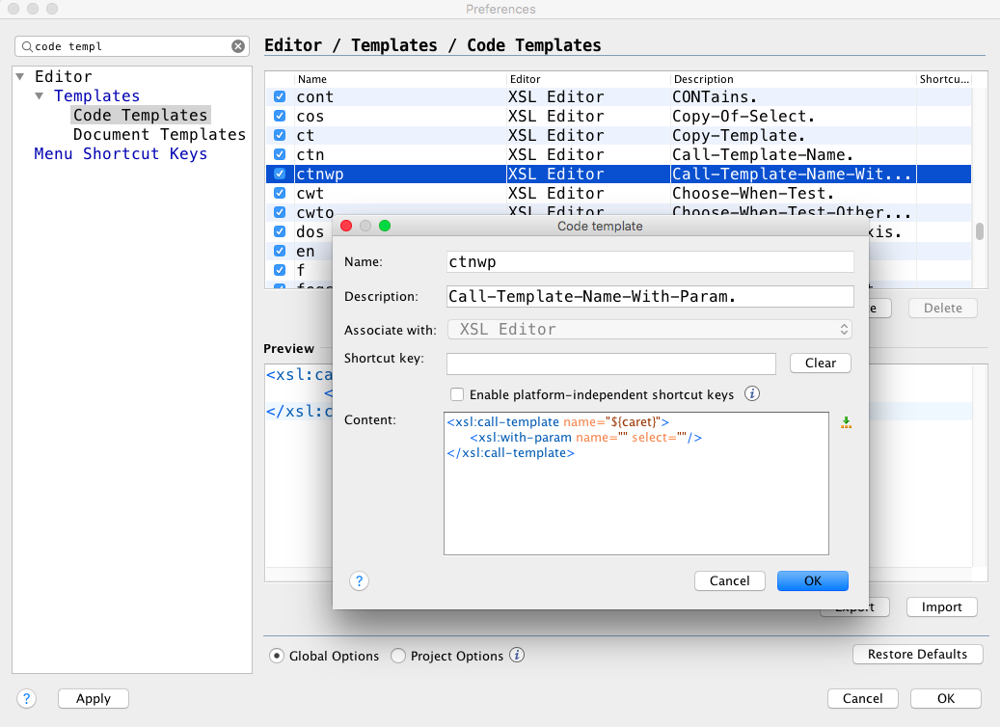</img>

To get a complete list of available code templates while working in the Text Mode in oXygen, press **`Ctrl-␣`** (control-space). You will only be shown the templates that make sense in the given context. So, to see built-in XSL templates, you have to be editing a XSL file.

Out of the box, you won't find any code templates for XML, but we'll create some. 

### Write Your Own Code Template for Nested Elements

At the beginning of these Guidelines, we learned how to use the oXygen shortcut to wrap some text in TEI elements **`<gramGrp>`** and **`<pos>`**. This is not unusual. In your dictionaries, you will often have groups of nested elements that repeat. For instance:  

- **`<gramGrp><pos></pos></gramGrp>`**  
- **`<form type="lemma"><orth></orth></form>`**    
- **`<cit type="translation"><quote></quote></cit>`**  

You could use the `⌘-E / ctrl-E` shortcut, but that wouldn't be very practical, especially since you would also need to enter attributes such as `@type` or `@xml:lang` etc. 

Let's say we want to create a code template which will wrap the selected text with `<gramGrp><pos></pos></gramGrp>`** and place the cursor after `<gramGrp>` when done.

To do that we need to:

1. Click on `New` in the Code Templates Editor.
2. Enter the abbreviate name for our code template 
3. Enter the description which explains what the code template does
4. Associate the code template with an editor - for TEI always choose XML
5. Write the XML code we want to have in the template in the Content field, then place the cursor between <pos></pos> where we want the selected text to appear
6. Click on the little green arrow next to the Content field to select an editor variable; choose the "Current Selected Text"
7. Then repeat the last two steps to indicate where you want the caret to appear after your code has been inserted: in this particular case, place the caret after </gramGrp> in the Content field and then select the `Cursor position after insert` from the list of editor variables.
8. Finally click `OK` to save your code template

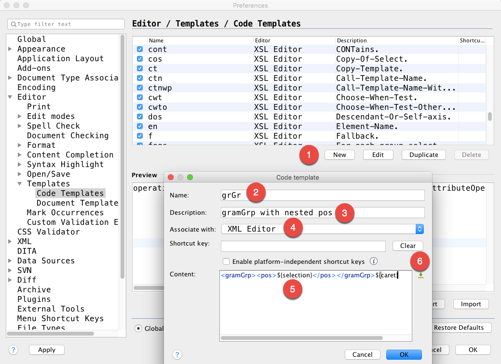</img>

Now you are ready to use your code template. Go to your dictionary TEI file and:

1. select the string in your dictionary entry which you want to mark up as a part of speech tag
2. invoke the code templates with `Ctrl-␣` (control-space)
3. scroll to the grGr code template (it will be the only one if this is the first time you are doing this) and click on it 
4. be amazed  
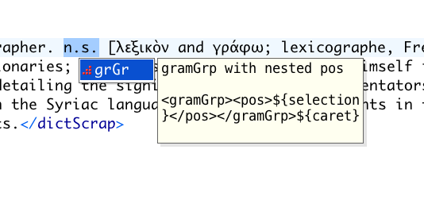</img>  
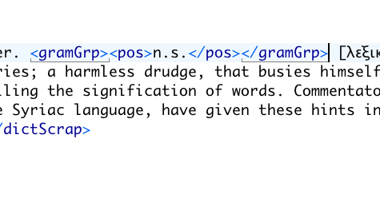</img>

#### Code Template for Nested Elements with a Twist

Sometimes, when encoding dictionaries, we have a need for a type of code that repeats, but that may differ in each instance by the value of an attribute. 

For instance, let's say you are using `<etym></etym>` to mark up etymologies, and within etymologies you are using <mentioned> to mark up the etymon, with the appropriate language code. 

You could either create different code templates for each language - and you will probably want to do that for the most common ones. If the largest number of etymons in your dictionary is from Latin, it would make sense to create a code template that looks like this:

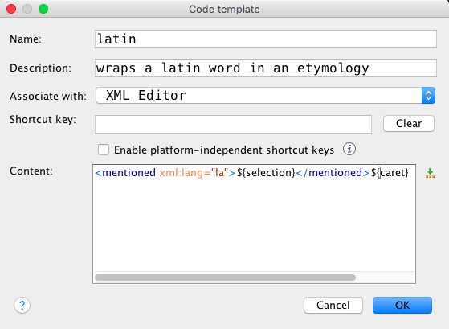</img>

But your dictionary may contain many different etymologies from many different languages, and it is probably not realistic to create individual code templates for each and every one of them. 

In those cases, you want to write a code template that will ask you interactively to add the value of the language attribute. 

To do that we will need to:

1. place the cursor between the quotation marks in `xml:lang=""`
2. click on the editorial variables icon and select the `Ask` editorial variable 

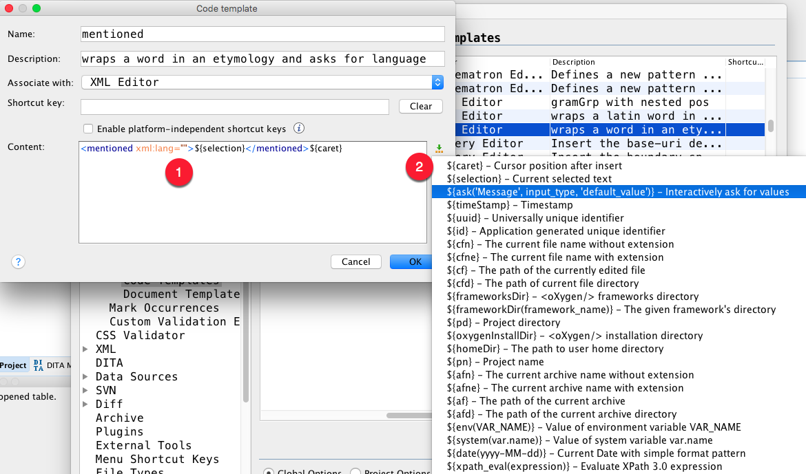</img>

The result will look like this:

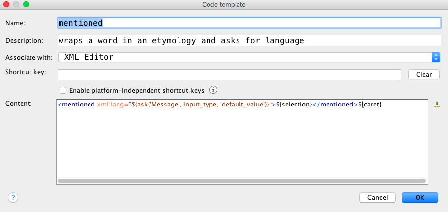</img>

We're almost there. To make this template code even more useful, do the following:

1. Replace `'Message'` with the message that you want the user to see. For instance `'Which language is this word from?'`
2. `input_type` you can leave as is
3. replace 'default_value' with the language code for that you want to appear automatically, for instance `'la' `for Latin. 

The content field should loook likе this:

    <mentioned xml:lang="${ask('Which langauge is this  word from?', input_type, 'la')}">${selection}</mentioned>${caret} 

To apply this code template in your TEI encoded dictionary:

1. select the etymon
2. invoke the code templates with `Ctrl-␣` (control-space)
3. select and click on the `mentioned` template
4. change the default "la" value with the appropriate language code 
5. click ok
6. be amazed

For the visually minded:

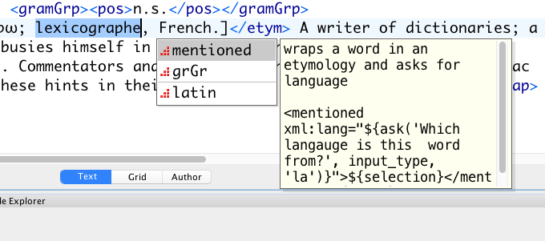</img>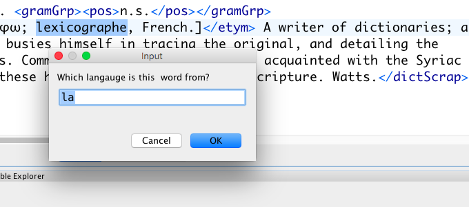</img>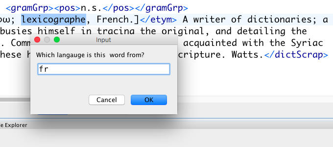</img>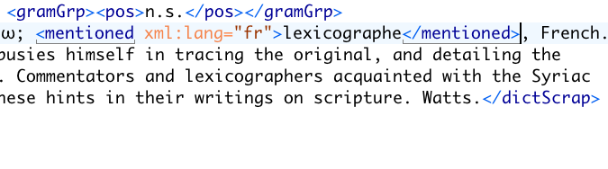</img>

###  Advanced Code Templates

The true power of code templates comes from the ability to evaluate XPath expressions on your selected text.

Let's imagine you are working on a Serbian-German-Latin dictionary that has been transcribed in plain text. Very often, the translations are simple and consist of a German string followed by a comma followed by a Latin string. 

For instance:

`реч, f. das Wort, verbum.`

Of course, you could try to convert this type of regularity with regular expressions as well, but we're learning here about code templates, so relax.

You've created code templates for `<form><orth></orth></form>` and for the `<gramGrp>` and your code currently looks like this:

    <entry>
    <form><orth>реч</orth></form>
    <gramGrp><pos>f.</pos></gramGrp> das Wort, verbum. </entry>

Wouldn't it be nice if you could separate the German translation from the Latin translation in one go and wrap everything in `<cit>`?

We can, using an oXygen editor variable `${xpath_eval()}` and a handy xPath function such as `substring-after()` and `substring-before()`. When you select your strings, you want everything before the comma to be marked up as a German translation, and everything after the comma and a space as a Latin translation. 

    <cit type="translation">
        <quote xml:lang="de">${xpath_eval(substring-before('${selection}',','))}</quote>
    </cit> 
    <cit type="translation">
        <quote xml:lang="la">${xpath_eval(substring-after('${selection}',', '))}</quote>
    </cit>

If you were ever looking for a proof why it's worth learning xPath for anything other than to explore your XML-encoded dictionaries, here it is:

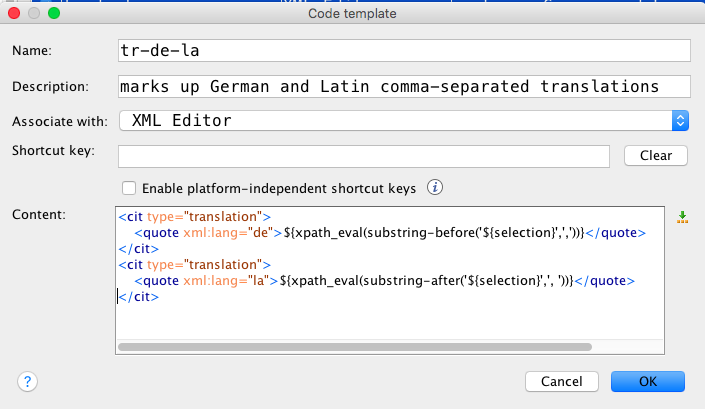</img>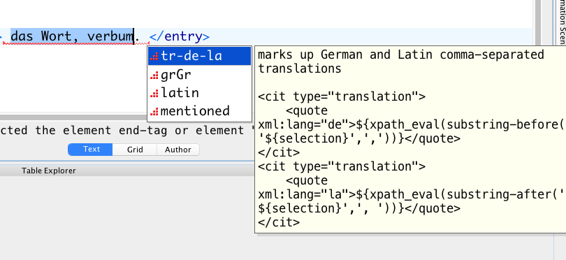</img>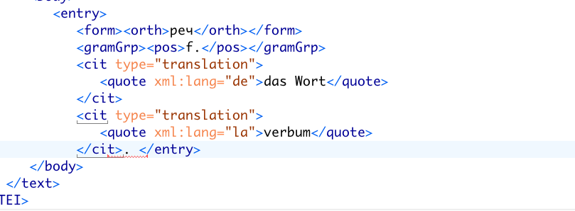</img>

## Styling Dictionaries in Author View</a>

