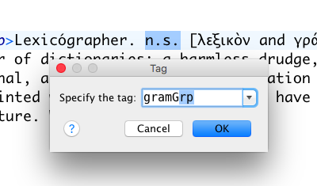
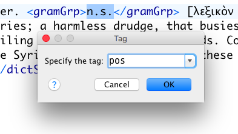
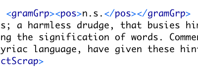
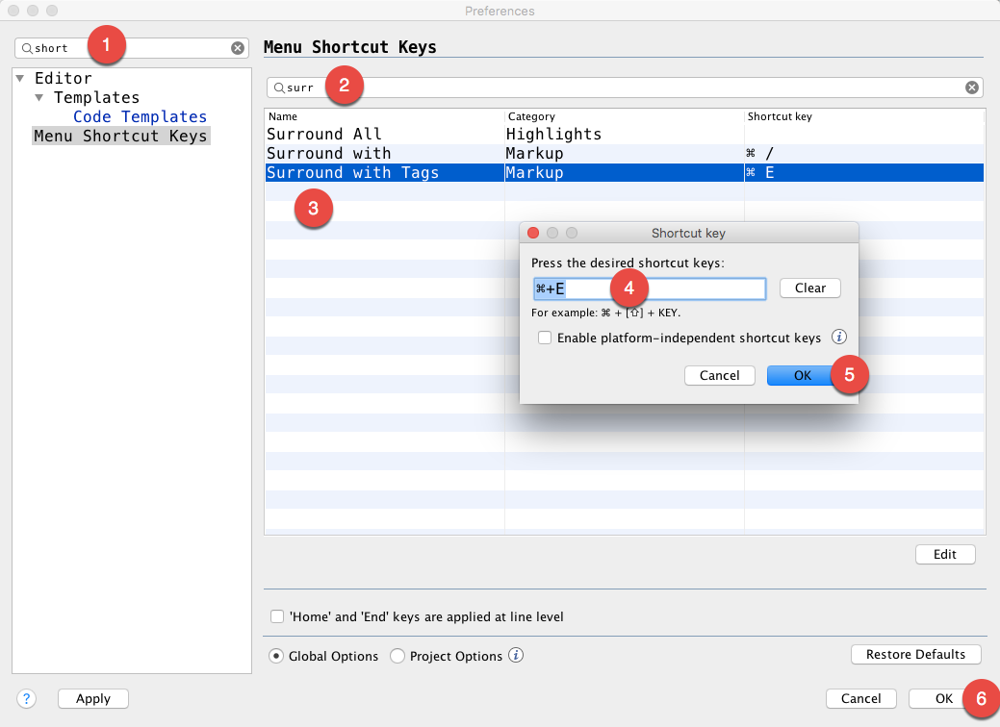

# Customizing oXygen XML for Pure Lexicographic Pleasure

**Topic**: This guideline is about customizing, shortcutting and improving your workflow using oXygen XML Editor.

**Contributor**: Toma Tasovac, Belgrade Center for Digital Humanities. 

**Version:** 0.1 (2016-03-29) 

## Table of Contents
[oXygen XML Editor](#whatis)  
[Default Shortcuts](#defaultshortcuts)  
[Changing Shortcuts](#changingshortcuts)  
[Basic Code Templates](#basiccodetemplates)  
[Advanced Code Templates](#advancedcodetemplates)  
[Styling Dictionaries in Author View](#stylingdictionaries) 

## oXygen XML Editor</a>

[oXygen XML](https://www.oxygenxml.com) is a versitile, commercial XML editor, which is quite popular with practitioners in the field of Digital Humanities. 

It offers:

- Multiple modes for editing XML documents: Text, Grid and (CSS-styled) Author *so that you can view your content differently and adapt the display of your dictionaries to your current editing needs.* [TODO SEE CSS VIEWS!!!!!!!]()
- Document and code templates: *so that you can easily create new files, reuse predefined "skeletons" for your content, reduce the number of characters you need to type and, sometimes, even surround plain text wiht complex, nested, XML elements* 
- Transformations to HTML and PDF *so that you can preview what your dictionary might look like online or in print*;
- Ability to add/extend customise frameworks. This, for instance, made it possible for us to create a plug-in called [TEI Completer add link]() which lets you *populate your TEI attributes with values stored and maintained in remote databases or provided by APIs*
- Support for all schema languages: such as RelaxNG, Schematron, XML Schema, DTDs, NVDL, NRL *so that you can validate your XML documents against various schemas*
- Content completion based on TEI RelaxNG schemas, *which helps you type faster and choose the fitting TEI element in a given context*
- Tool tip documentatioon based on TEIRelaxNG schemas, *so that you can check what the TEI Guidelines say about a given element wihtout leaving the document you are editing*
- XQuery directly against XML files and local/remote XML databases like eXist, *so that you can search your dictionaries and explore their contents while you are working on them*
- WebDAV and FTP support for access to files on remote servers/CMS
- Built-in subversion client for collaborative version control and visual change management 
- Included graphical XMLDiff to analyze differences between documents, etc.

It goes beyond the scope of this guideline to describe all of oXygen's functionalities. In the rest of this document, we will focus mostly on time-saving tips and hints for working with lexical data, although many of these thips will apply to other uses of oXygen. 

## Shortcuts

### Default Shortcuts

Shortcuts are very important because XML is, as you know, quite verbose. The more detailed your encoding is, the more typing you need to do. 

1. **`⌘-E / ctrl-E` surrounds the selected text with tags**   
This is probably the single most useful and most frequently used shortcut that you will end up using *all the time.* Because the text remains selected even after the first set of tags have been insterted, the most efficient way of wrapping text with multiple, nested tags is to start from the outer element.  
</img>  
</img>  
</img>  

2. **Refactoring shortcuts**  
TODO

### Changing Shortcuts

If the oXygen shortcuts are not to your liking or difficult to remember, you can change them yourself.

Open the preferences, then follow the procedure as shown on the image below:  
    1. start typing "shortcuts"   
    2. start typing the name of the command whose shortcut you want to change   
    3. double-klick the command to get to the shortcut editing window  
    4. press the desired shortcut keys to replace the current shotcut  
    5. click on OK  
    6. click on OK  

</img>

TODO: Explain the difference between Global Options and Project Options. 
 

## Code Templates 

###  Basic Code Templates 

Code templates are code fragments that can be inserted quickly at the current editing position. 

Oxygen set of built-in code templates. To get a complete list of available code templates, press `Ctrl-⇧-␣` (control-shift-space) in Text mode. 

TODO the rest

###  Advanced Code Templates

TODO Describe how to write and deploy advanced code templates with XPath expressions that can be evaluated on selected text. 

take screenshot from Vuk -- separating two different language translations by comma; or more complex homograph stuff with numbers 

## Styling Dictionaries in Author View</a>

